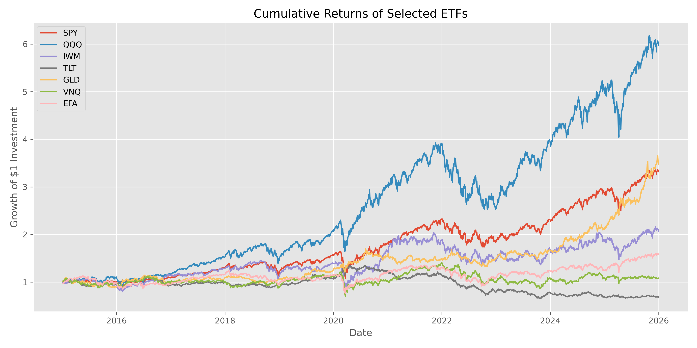
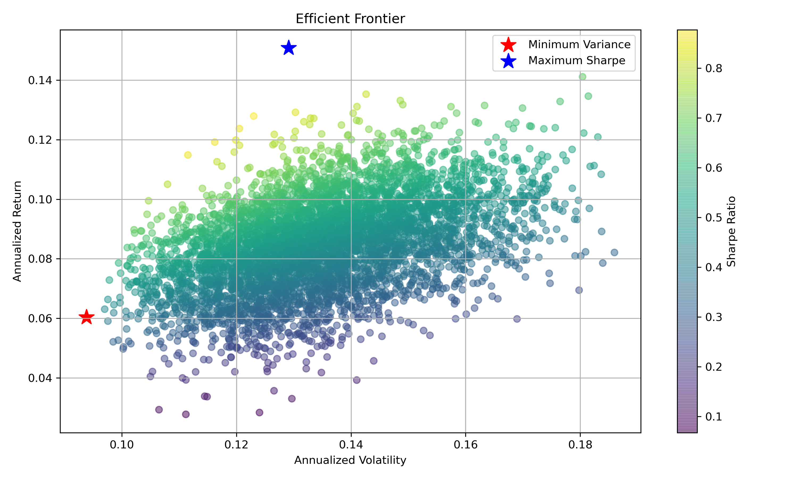
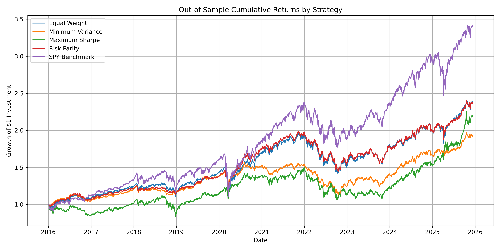
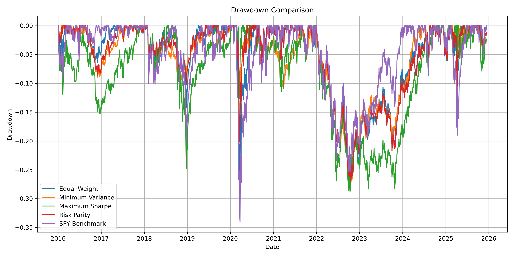
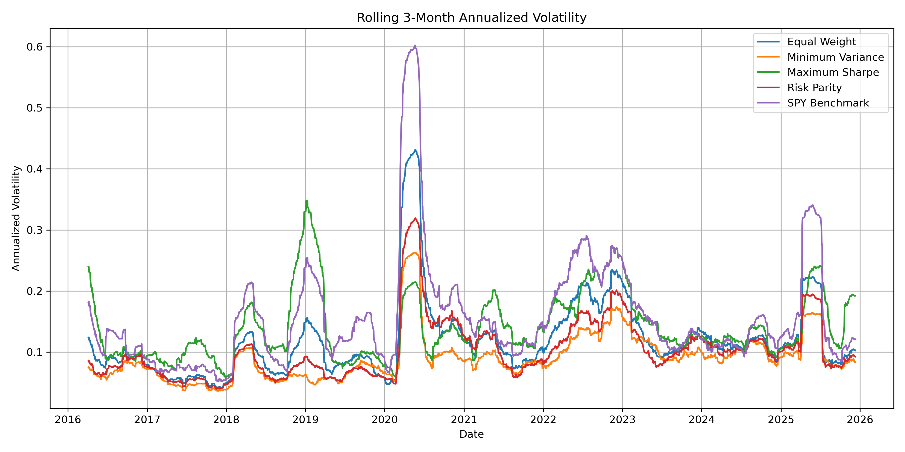
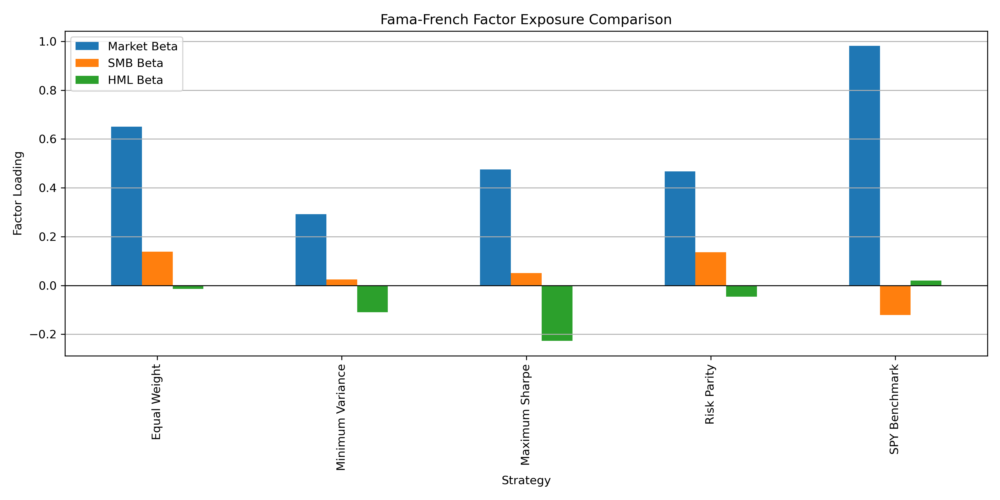

# Quantitative Portfolio Optimization and Risk Management with Factor Analysis

## 1. Project Overview

This project compares different portfolio construction methods across major asset-class ETFs and evaluates their risk-adjusted performance through rolling-window backtesting and Fama-French factor regression.

## 2. Research Question

Can portfolio optimization methods improve risk-adjusted performance compared with a simple SPY benchmark, and how can portfolio returns be explained by systematic risk factors?

## 3. Data

The project uses daily historical ETF price data from 2015 to 2025. The selected ETFs include SPY, QQQ, IWM, TLT, GLD, VNQ, and EFA, representing U.S. equities, technology stocks, small-cap stocks, long-term Treasury bonds, gold, real estate, and international developed-market equities.

Historical ETF price data were manually downloaded from Investing.com due to API access limitations. The analysis uses cleaned daily price data stored in the processed data folder.

## 4. Methodology

The project implements four portfolio construction methods:

- Equal Weight
- Minimum Variance
- Maximum Sharpe
- Risk Parity

A rolling-window backtest is conducted using a 252-day lookback window and 21-day rebalancing frequency. Portfolio performance is evaluated using annualized return, annualized volatility, Sharpe ratio, maximum drawdown, historical VaR, and historical CVaR.

Fama-French three-factor regression is used to analyze portfolio exposure to market, size, and value factors.

## 5. Key Results

The SPY benchmark achieved the highest annualized return, but it also had the largest volatility and downside risk. Among the optimized strategies, the risk parity portfolio delivered the strongest risk-adjusted performance, with a Sharpe ratio close to SPY but lower volatility and smaller drawdown.

The minimum variance portfolio achieved the lowest volatility and tail risk, while the maximum Sharpe portfolio showed weaker out-of-sample performance, suggesting sensitivity to estimation error.

## 6. Figures

- Cumulative Returns of Selected ETFs

- Efficient Frontier

- Out-of-Sample Cumulative Returns by Strategy

- Drawdown Comparison

- Rolling 3-Month Annualized Volatility

- Fama-French Factor Exposure Comparison

## 7. Factor Regression Findings

The SPY benchmark had a market beta close to one and an R-squared above 0.99, indicating that its returns are almost entirely explained by market exposure.

Optimized portfolios had lower market betas than SPY, reflecting diversification across bonds, gold, and other asset classes. The maximum Sharpe portfolio showed negative HML exposure, consistent with its allocation toward growth-oriented assets such as QQQ.

## 8. Transaction Cost and Turnover Analysis

A transaction cost model was added to evaluate the practical impact of rebalancing. The maximum Sharpe strategy had the highest average turnover, around 49.5% per rebalance, and experienced the largest decline in net performance after transaction costs. Risk parity and equal weight portfolios had lower turnover and were less affected by implementation costs.

This extension shows that optimization-based strategies can appear attractive before costs, but their practical performance depends heavily on turnover and rebalancing stability.

## 9. Stress Testing

Stress tests were conducted for the 2020 COVID crash and the 2022 rate hike period. During the COVID crash, optimized portfolios generally experienced smaller losses and drawdowns than the SPY benchmark. However, during the 2022 rate hike period, diversification benefits weakened as both equities and long-duration bonds came under pressure.

These results suggest that portfolio diversification benefits are regime-dependent and that stress testing is necessary for evaluating strategy robustness under different market environments.

## 10. Limitations

This project does not fully model transaction costs, bid-ask spreads, taxes, or market liquidity constraints. The optimization results are sensitive to historical return and covariance estimates. Historical performance does not guarantee future results.

## 11. Future Improvements

Future extensions could include transaction cost modeling, turnover analysis, Ledoit-Wolf covariance shrinkage, Black-Litterman optimization, and Fama-French five-factor regression.

